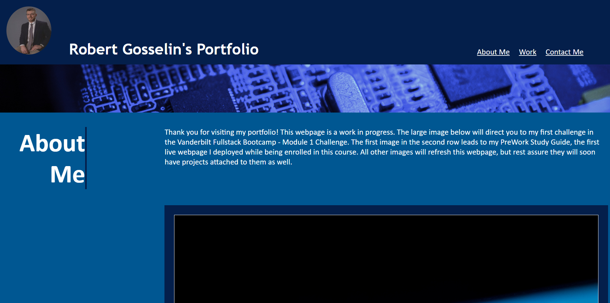

# module-2-challenge

Full Stack Web Development Project 1

https://bcgosselin.github.io/module-2-challenge/

## Description

This project is Robert Gosselin's second web application challenge. This project was created to showcase his skills and aptitude using only text based instructions. This webpage's index and style sheet was written by hand utilizing below resources [Credits](#credits). The goal of this challenge was to develop and engineer a fuctioning website that showcases completed and future projects. Everything included was apart of an ongoing bootcamp to develop and hone Full Stack Web Development skills.

## Table of Contents (Optional)

- [Installation](#installation)
- [Usage](#usage)
- [Credits](#credits)
- [License](#license)

## Installation

NA

## Usage

Feel free to view below screenshot (ctrl + click).

## Credits

CODE
Utilized code from module-1-challenge to organize and structure HTML and CSS
    https://github.com/bcgosselin/module-1-challenge

Utilized code from module-1-challenge to set font
    https://github.com/bcgosselin/module-1-challenge

Referrenced common CSS commands for designing webpage:
    https://www.linkedin.com/pulse/25-essential-commands-get-started-css-cascading-style-roshan-sharma/

Referrenced to allow for Responsive Web Design
    https://www.w3schools.com/css/css3_mediaqueries.asp

Utilized for Border Right Attribute
    https://stackoverflow.com/questions/3148415/how-to-make-a-vertical-line-in-html
    
IMAGES
Downloaded uncopyrighted images from:
    https://unsplash.com/s/photos/blue-computer

Used to round avatar/article img:
    https://www.w3schools.com/howto/howto_css_rounded_images.asp

Used to adjust background position and size of avatar/article:
    https://www.w3schools.com/cssref/pr_background-position.php
    https://www.w3schools.com/cssref/css3_pr_background-size.php

Used to set hover:
    https://www.w3schools.com/cssref/sel_hover.php

## License

MIT License

Copyright (c) [2023] [Robert Gosselin]

Permission is hereby granted, free of charge, to any person obtaining a copy
of this software and associated documentation files (the "Software"), to deal
in the Software without restriction, including without limitation the rights
to use, copy, modify, merge, publish, distribute, sublicense, and/or sell
copies of the Software, and to permit persons to whom the Software is
furnished to do so, subject to the following conditions:

The above copyright notice and this permission notice shall be included in all
copies or substantial portions of the Software.

THE SOFTWARE IS PROVIDED "AS IS", WITHOUT WARRANTY OF ANY KIND, EXPRESS OR
IMPLIED, INCLUDING BUT NOT LIMITED TO THE WARRANTIES OF MERCHANTABILITY,
FITNESS FOR A PARTICULAR PURPOSE AND NONINFRINGEMENT. IN NO EVENT SHALL THE
AUTHORS OR COPYRIGHT HOLDERS BE LIABLE FOR ANY CLAIM, DAMAGES OR OTHER
LIABILITY, WHETHER IN AN ACTION OF CONTRACT, TORT OR OTHERWISE, ARISING FROM,
OUT OF OR IN CONNECTION WITH THE SOFTWARE OR THE USE OR OTHER DEALINGS IN THE
SOFTWARE.
